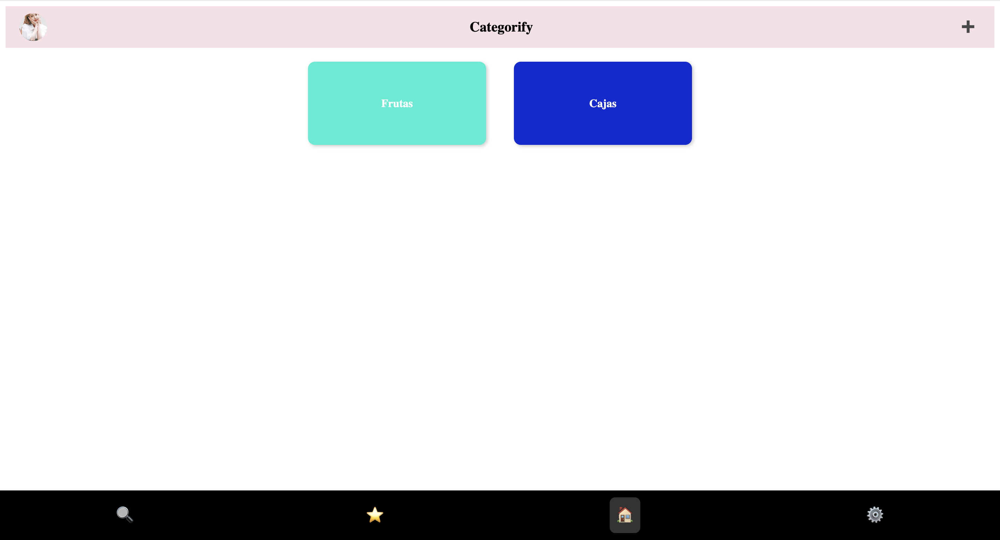
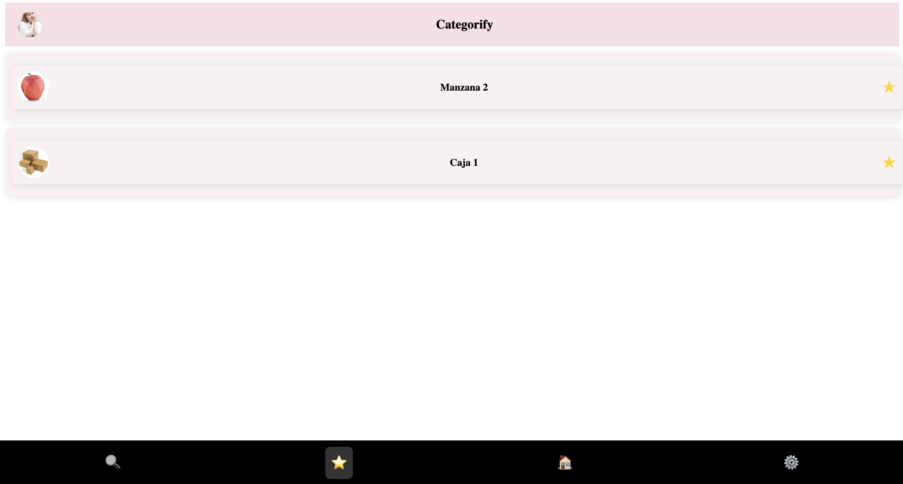
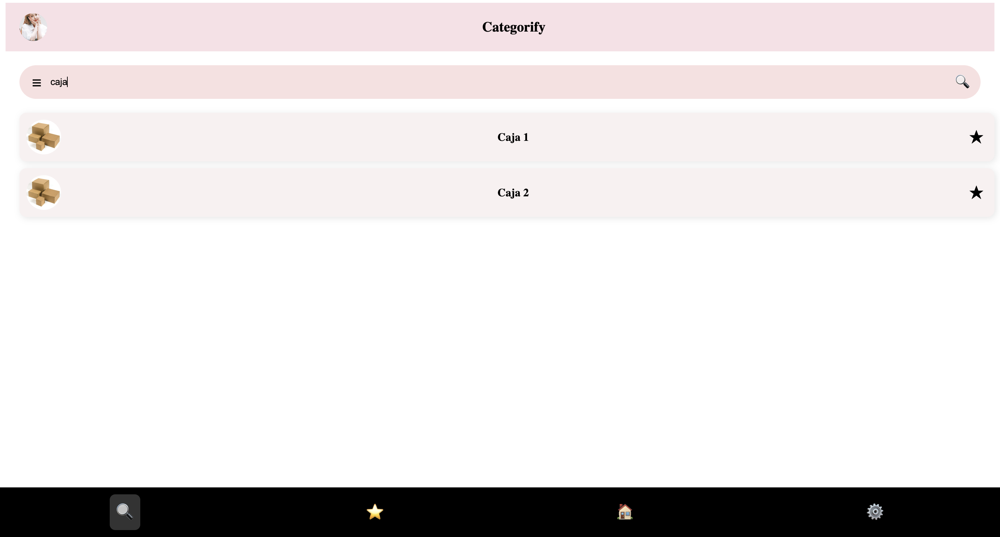

# Categorify
Categorify is a full-stack web application built with Angular (frontend) and Express (backend), designed to organize and manage URLs in a structured and visual way.

The application allows users to create color-coded categories and store URL entries inside them, including metadata such as description, image, and favorite status.

The app is deployed in render so you dont need to deployed it local: https://categorify.onrender.com

The full project (frontend + backend) is on GitHub, but it's hosted on Render for demonstration purposes. Companies can view and interact with the app online without needing to run it locally.

## Overview
Categorify provides a clean and intuitive interface to:
1. Create and manage custom categories
2. Store URLs inside categories
3. Add metadata (description, image)
4. Mark URLs as favorites
5. Search across all stored URLs
6. Edit and delete both categories and URLs

The system follows a client–server architecture with a RESTful API and a reactive frontend using state management via BehaviorSubject.

## Architecture

### Frontend
Framework: Angular
State management: RxJS (BehaviorSubject)
Routing: Angular Router
Forms: Template-driven forms
HTTP Communication: Angular HttpClient

### Main functional modules
- Home – Displays all categories
- Category Detail – Lists URLs inside a category
- Add URL – Adds a new URL to a category
- URL Detail – View and edit URL metadata
- Favorites – Aggregates all favorite URLs
- Search – Full-text search by URL name

### Service: CategoryService
- Loads categories from backend
- Stores them in a BehaviorSubject
- Derives favorites dynamically
- Synchronizes state after each mutation (CRUD operations)

### Backend
Runtime: Node.js
Framework: Express
Database: MongoDB
Architecture: Layered (Routes → Service → Data Access)

### Data model
A Categoria document:

{
  name: String,
  color: String,
  items: [
    {
      name: String,
      url: String,
      description: String,
      imageUrl: String,
      isFavorite: Boolean
    }
  ]
}
Each category contains embedded URL items. Each URL has its own _id (ObjectId).

## REST API
Base URL: /api/categorias
API Endpoints

| Method | Endpoint                                   | Description                |
|--------|--------------------------------------------|----------------------------|
| GET    | `/`                                        | Get all categories         |
| POST   | `/`                                        | Create new category        |
| DELETE | `/:id`                                     | Delete category            |
| PUT    | `/:id/add-url`                             | Add URL to category        |
| PUT    | `/:categoryId/update-url/:urlId`           | Update URL                 |
| DELETE | `/:categoryId/delete-url/:urlId`           | Delete URL                 |

All endpoints return JSON responses.

### Core features
1. Categories
- Create category with custom name and color
- Delete category (with all nested URLs)

2. RL Management
- Add URL with:
    - Name (required)
    - URL (required)
    - Description (optional)
    - Image (Base64)
    - Favorite status
- Edit URL metadata
- Delete URL

3. Favorites
- Toggle favorite state
- Centralized favorite view
- Automatically synchronized across pages

4. Search
- Real-time filtering by URL name
- Case-insensitive matching

### Project structure
```
categorify/
│
├── backend/
│   ├── index.js
│   ├── modelos/
│   ├── rutas/
│   ├── servicios/
│   └── lib/
│
└── frontend/
    ├── src/app/
        ├── componentes/
        |       ├── category-card
        |       ├── create-category
        |       ├── header
        |       ├── header-fs
        |       ├── nav-bar
        |       ├── url-card
        ├── pages/
        |       ├── add-url
        |       ├── category-deatil
        |       ├── favourites
        |       ├── home
        |       ├── search
        |       ├── url-detail
        └── servicios/
```

The backend follows a service-based architecture:
- Routes handle HTTP layer
- Service encapsulates business logic
- MongoLib abstracts database operations

The frontend is component-driven and modular.

## Data Flow

1. User triggers UI action
2. Angular Service performs HTTP request
3. Backend Route calls Service layer
4. Service interacts with MongoDB
5. Updated data returned
6. Frontend reloads categories and updates reactive streams

## Local Development
1. Clone the repository

```bash
git clone https://github.com/AdrianMalmierca/Categorify
```

### Backend
2. Navigates to the backend project directory.
```bash
cd backend
```

3. Installs all required dependencies defined in package.json.
```bash
npm install
```

4. Launches the Express server.
```bash
npm run start
```

The backend exposes the REST API under: http://localhost:3000/api/categorias

Environment variables required:
- PORT=3000
- MONGO_URI=your_mongodb_connection_string

### Frontend
5. Navigates to the Angular project directory.
```bash
cd frontend
```

6. Installs all frontend dependencies.
```bash
npm install
```

7. Starts the Angular development server and compiles the application in development mode.
```bash
ng serve
```

By default:
Frontend → http://localhost:4200
Backend  → http://localhost:3000

Note: In production, the API URL must point to the deployed backend instead of localhost.

## Execution:

### Home page
The main page is the Home where you can see all the categories created, with the name and color you selected. You can also create a new category with the '+' button.


### Favourites page
On this page you can see all the elements you add to favourites.


In case you didn't add any element to favourites, you'll se a messsage which says theres nothing in favourites.


### Search page
On this page you can search the products, where will show all the coincides by the names.


### Create category page
From home when you click on the '+' button you can create a new category, choosing the name and the color with the color picker.


### Create element page
On this page you can create one element, where you have to put the image and the name, these attributes are required, the url and the description are optional.


### Caterory detail page
When you click on a category from home, you'll see all the elements of this category, where you can create one element with the '+' button, or delate all the category with the trash icon. You can also check all the information of one element if you click on it.


### Element detail page
When you click on an item from the category detail, favourites or search you can see all the option, where you can modify all the attributes except the image.


## Deployment
The project is deployed on Render.
Deployment characteristics:
- Backend deployed as Node service
- MongoDB hosted externally
- Frontend built and served in production mode
- CORS enabled

## Technical Highlights
- Reactive state management with RxJS
- Embedded document modeling in MongoDB
- Clean separation of concerns (Route / Service / Data layer)
- Centralized favorites aggregation logic
- Base64 image storage for simplicity
- Full CRUD operations across nested resources

## Potential Improvements
- Authentication & user accounts
- Pagination for large datasets
- Validation middleware (e.g., Joi)
- Unit and integration testing
- Dockerization
- Environment-based API configuration
- Optimized Mongo queries (avoid full collection fetch for updates)

## What problems does this project solve?
Categorify solves common productivity and organization issues:

### Bookmark chaos
 Most users store URLs in:
- Browser bookmarks (poorly structured)
- Messaging apps
- Notes apps
- Random tabs left open

There is no semantic organization.

Categorify introduces structured categorization with visual grouping (color-coded categories).

### Lack of context in bookmarks
Traditional bookmarks only store:
- Title
- URL

Categorify allows:
- Description
- Custom image
- Favorite flag
- Category grouping

This adds semantic metadata to links.

### Poor discoverability
Standard bookmark systems lack:
- Global search
- Cross-category favorites
- Quick filtering

Categorify provides:
- Real-time search across all items
- Favorites aggregation view
- Category-based filtering

### No CRUD control in basic bookmark tools
This app provides full REST-based CRUD:
- Create categories
- Delete categories
- Add URLs
- Update URLs
- Delete URLs
- Toggle favorites

### State management and data consistency
- Frontend state is synchronized with backend using:
- Angular BehaviorSubject
- REST API
- MongoDB persistence

Ensures:
- Reactive UI updates
- Backend data consistency
- Single source of truth

## What did I learn?
I learned how to create a whole App in Angular, using a database online, which is MongoDB, and locating in a server so you can use whenever you want without run locally. At first understand the logic of Angular, how the components and the pages are comunicated is quiet hard, understand who work the services... But once you understand is very logic

## Author
Adrián Martín Malmierca

Computer Engineer & Mobile Applications Master's Student